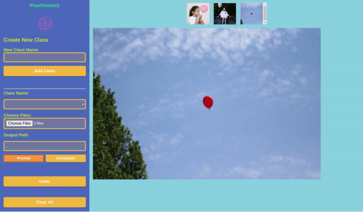

# Interactive Annotation Using Segment Anything 🖌️✨


🎉 Welcome to the Interactive Annotation repository!

🌟 This project is all about making segmentation more accessible, faster, accurate and enjoyable for everyone using recently released segement anything model. Let's create an amazing annotation experience together! 🚀


### 📽️ Interactive Annotation "Annotation Mode" in Action


### 📽️ Interactive Annotation "Preview Mode" Mode


# 🌠 Features

Easy-to-use interface for segmenting images using Segment Anything.

Export annotations in Json formats.

Add custom class names for annotations.

Navigate through images using arrow buttons or arrow keys on the keyboard.

Preview mode or annotation mode.


🛠️ Installation

Follow these simple steps to set up the Interactive Annotation tool:

Install front dependencies using npm install

Install backend dependencies using pip install -r requirments.txt

# 📖 Usage

Load an image by clicking the "Open Image" button.

Choose your preferred brush size and color.

Start segmenting instances in the image.

Add or edit labels for each instance.
Export annotations in your desired format.

# 🤝 How to Contribute

I would absolutely 💖 contributions from community! 

# 📃 License
This project is licensed under the MIT License.

# 🌟 Show Your Support
If you find this project helpful or interesting, please give it a ⭐️ to help it reach more people! And if you have any feedback, ideas, or want to contribute, feel free to open an issue or a pull request. We're always excited to hear from you! 🤗

Happy annotating! 🎉

## References
```
@article{kirillov2023segany,
  title={Segment Anything},
  author={Kirillov, Alexander and Mintun, Eric and Ravi, Nikhila and Mao, Hanzi and Rolland, Chloe and Gustafson, Laura and Xiao, Tete and Whitehead, Spencer and Berg, Alexander C. and Lo, Wan-Yen and Doll{\'a}r, Piotr and Girshick, Ross},
  journal={arXiv:2304.02643},
  year={2023}
}
```